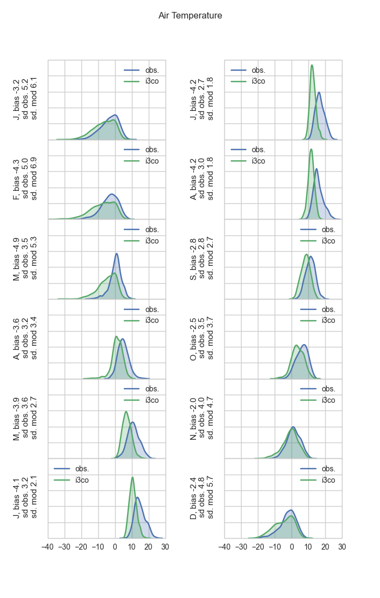

# Monthly means

# Taylor diagrams

# Detailed comparisons
i1a.png)
i1b.png)
i1c.png)
i3an.png)
i3ao.png)
i3bn.png)
i3bo.png)
i3cn.png)
i3co.png)
i1a.png)
i1b.png)
i1c.png)
i3an.png)
i3ao.png)
i3bn.png)
i3bo.png)
i3cn.png)
i3co.png)
i1a.png)
i1b.png)
i1c.png)
i3an.png)
i3ao.png)
i3bn.png)
i3bo.png)
i3cn.png)
i3co.png)
i1a.png)
i1b.png)
i1c.png)
i3an.png)
i3ao.png)
i3bn.png)
i3bo.png)
i3cn.png)
i3co.png)
i1a.png)
i1b.png)
i1c.png)
i3an.png)
i3ao.png)
i3bn.png)
i3bo.png)
i3cn.png)
i3co.png)
i1a.png)
i1b.png)
i1c.png)
i3an.png)
i3ao.png)
i3bn.png)
i3bo.png)
i3cn.png)
i3co.png)
i1a.png)
i1b.png)
i1c.png)
i3an.png)
i3ao.png)
i3bn.png)
i3bo.png)
i3cn.png)
i3co.png)

