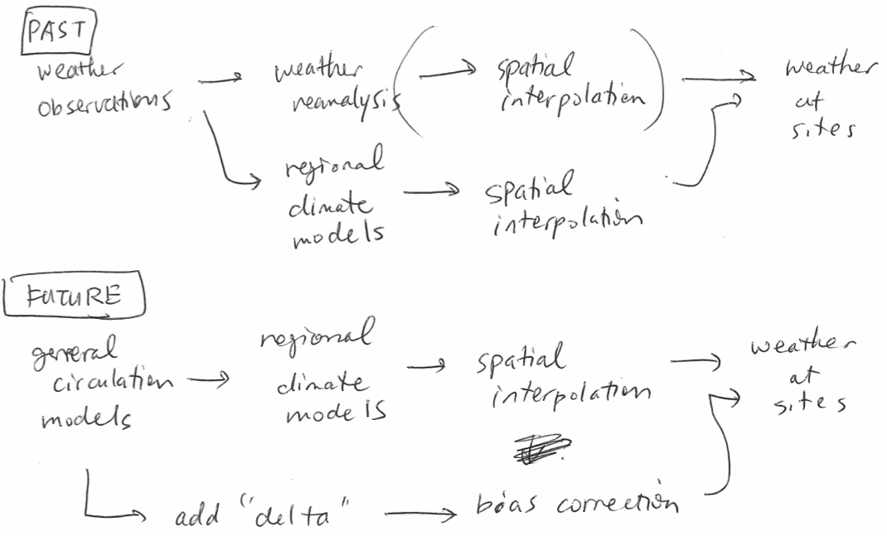

obtaining weather
=================

scenarios??
===========

Anybody? 

weather interpolation
=====================

spatial interpolation     | delta change method (_bias correction_ is the key)
:-------------------------|:-------------------------------------------------
Simple                    | More complex
Does not correct for time | Does not correct for geography
Very good for past weather | Necessary for future meteo'l scenario
Scripts done              | Not done (new postdoc?)

weather data/simulations
========================

NORA10      | CORDEX             | Frode's group
:-----------|:-------------------|:---------
11 x 11 km   | 12.5 x 12.5 km     | 3 x 3 km   
1958 - 2012  | past and future    | 1961 - 2013
North Atlantic to Baltic | whole world (?) | Norway
almost all variables | everything | temperature and precipitation
already available | ongoing       | already available

lake models
===========

MyLake    | FLake
:---------|:------------
depth and bathymetry | depth only 
coarse depth resolution | smooth curves
chemistry also          | light and temperature only
many developments       | no development (?)

Would be good to get FLake to take the bathymetry into account...

[MyLake on COMSAT lakes](temperature profile -- comsat field vs MyLake lots assumptions uncalibrated.pdf)

abel
====

small group deomo later

extra bits
==========
with Frode
----------

- the new postdoc will be starting within a few months hopefully. 
- 3 by 3 km for Norway is good quality. I thought it could be useful as a quality check for NORA10
- Even higher resolution work is done (?). WIP. 
- Also heard a bit about globe-wide application of 'something like RCM'. 
- Frode would like to be in communication also for BiWa and other projects. It brings contexts to the climate scenarios. His group also does some work on surface vegetation model. 
- The delta-method is more complex and advanced than simply adding the same numbers everywhere. Bias correction is the key concept there, and this may be a big advantage compared to using CORDEX directly, or spatial interpolation from it. I'm not sure the quality of CORDEX models in comparison to ENSEMBLES, but there was some seasonality problems with ENSEMBLES. (By the way the argument for the previous study was that we use the same model for the past and the future so the models will be hopefully 'equally wrong' for the past and the future.) Seasonality (supposedly bias-correction is all about this) and extremes (CORDEX is good at it? but the advanced bias correction with probability distribution can capture this?) are important temporal variation. 
- Spatial interpolation is pretty much done. Frode and his new post doc may be able to contribute streamlining/automating the bias correction delta-method. Frode is well aware of the possibility of expanding to many thousands of lakes later. 
- Speaking of the scalability, CORDEX does have advantage to go to other continents. Spatial resolution may become coarser but it's in the same framework. 
- Notur. Looks like both Frode and I have experiences with it well. 
- Norstore. Frode has experiences there. By the way it will be the platform for one of the CORDEX repositories. 