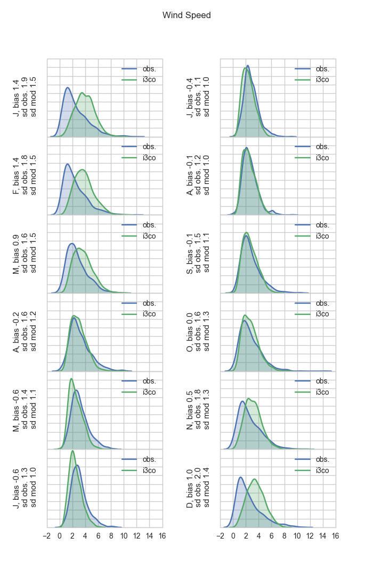
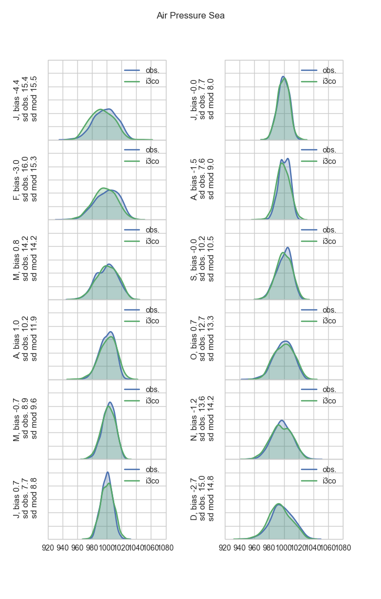
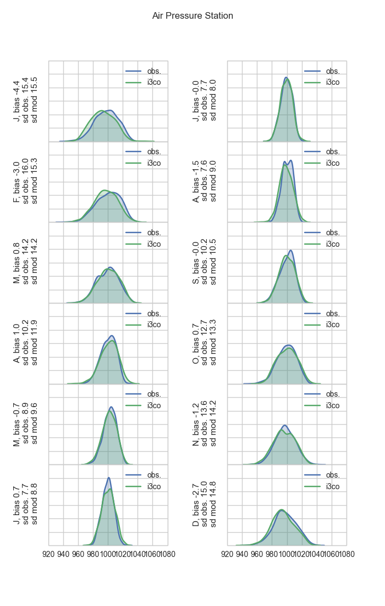
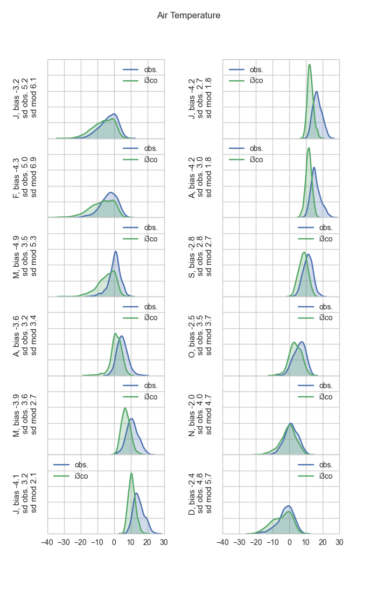
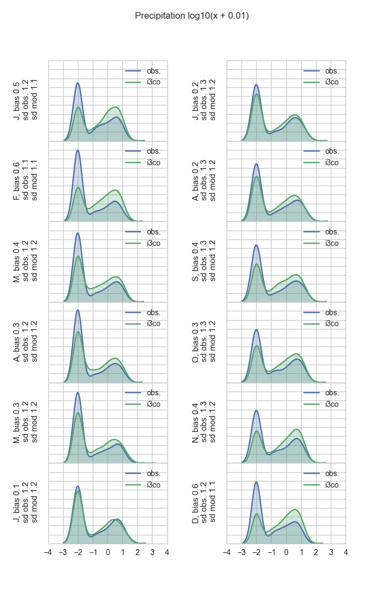

Based on daily data for 1970-2005 (36 years), at Blindern

Taylor diagrams
===============
.png)

KDEs
====

		

	

Discussion points
=================

RCM results are artificial weather created from data binding to the latest iteration of GCM. Therefore, historical simulation as shown in these are not meant to be accurate on day to day basis. Rather, it should achieve extremes and averages equally frequently as the real weather. So R being near zero is by design. 

It is however not that often good to get zero bias and good extremes at our place, especially on the seasonal level. This is among others 

1) because the underlying big brother GCM has uncertainties and so is RCM, 
2) because the RCM is on average tuned to be best for the whole Europe and taking out only in Oslo introduces uncertainty, and 
3) because Blindern station is not at the grid vertex of RCM so the values are spatially interpolated. 

What Frode and I were talking about (as I understood) was to ask hopefully Benjamin to reduce uncertainty 2) by bias correction. I have done 3), and 1) is something somebody else needs to worry about, not us (though it needs to be always mentioned), but bias due to 1) may be fixed by bias correction.  

We would want a model to achieve ideally no bias, similar standard deviation (extremes). We are not concerned with correlation, but Taylor diagrams show it anyway. That is we want those months to come to the dashed lines in the Taylor diagrams, and KDEs overlapping all months. 